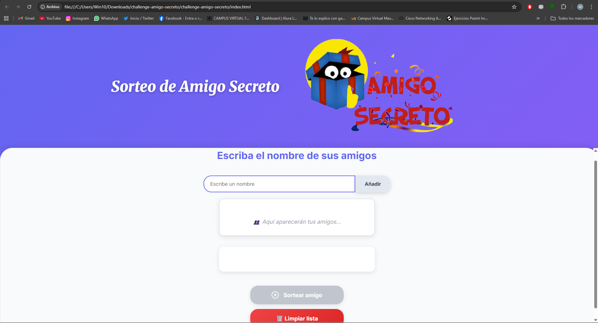
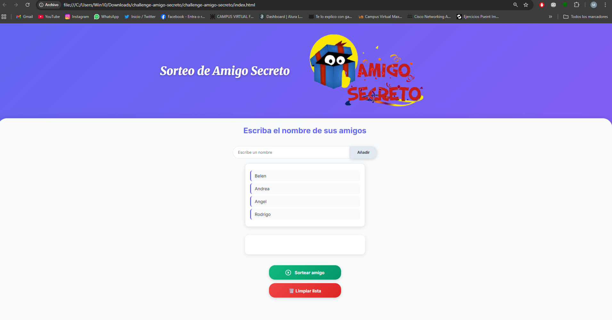
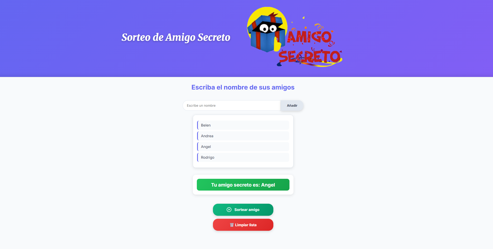

# 🎁 Amigo Secreto - Challenge

Aplicación web para realizar sorteos de amigo secreto de forma fácil y divertida.

## 🚀 Funcionalidades

- ✅ **Agregar amigos**: Validación de nombres (solo letras y espacios)
- ✅ **Lista dinámica**: Visualización en tiempo real de participantes
- ✅ **Sorteo aleatorio**: Selección aleatoria del amigo secreto
- ✅ **Validaciones**: Previene nombres duplicados y campos vacíos
- ✅ **Limpiar lista**: Opción para empezar de nuevo
- ✅ **Interfaz responsive**: Diseño moderno con gradientes y animaciones

## 🛠️ Tecnologías utilizadas

- HTML5
- CSS3 (Flexbox, Gradientes, Animaciones)
- JavaScript (Vanilla)
- Git & GitHub

## 📱 Cómo usar

1. Ingresa los nombres de los participantes
2. Haz clic en "Añadir" o presiona Enter
3. Una vez que tengas al menos 2 participantes, haz clic en "Sortear amigo"
4. ¡Descubre quién es tu amigo secreto!

## 🎨 Características del diseño

- Diseño responsive que se adapta a diferentes pantallas
- Gradientes modernos y efectos hover
- Animaciones suaves en las interacciones
- Validación visual del estado de los botones

## 📷 Capturas de pantalla

### Pantalla inicial

### Agregando participantes

### Resultado del sorteo

---

Desarrollado como parte del Challenge de Alura Latam 🚀